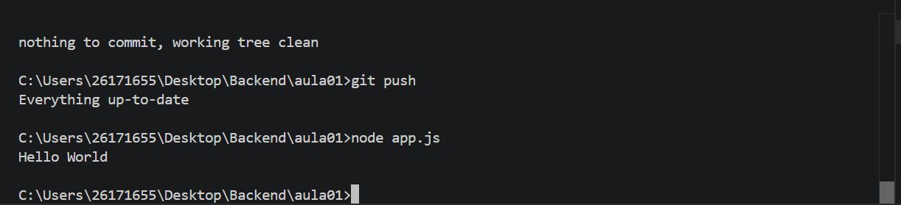

# Meu primeiro projeto Javascript

## Aluno 🍆💦

Nome: Iago Damazio Amorim<br>
Turma: DS1A<br>
Professor: Vitor Lima<br>


---
## Sobre 🔥🔥

Este projeto foi desenvolvido durante a primeira aula de Javascript.

O objetivo foi aprender:
- Utilizar o VS Code;
- Executar o Javascript com Node.js
- Utilizar o terminal
- Criar documento utilizando Markdown

---
## Estruturas 🤤🧱🗂️

```
MeuPrimeiroProjetoJS
|
|-app.js
|-informacoes.js
|-operadores.js
|-variavel.js
|-readme.md
|-imagem/

```
## Como executar

```bash
node app.js    
```

## Código

```javascript
console.log("Hello World");
```

## Resultado



## Tecnologia
- JavaScript
- Node.js
- Visual Studio Code
- Markdown

## O que eu aprendi
- Criar arquivo JavaScript.
- Executar programar.
- Utilizar terminal.
- Criar README.
- Instalar extensões
- Utilizar Markdown
- GIT
- Variável
- Operadores

<!--
git add .
git commit -m "Arquivos criados app, operadores, variavel, informacoes"
git push
-->